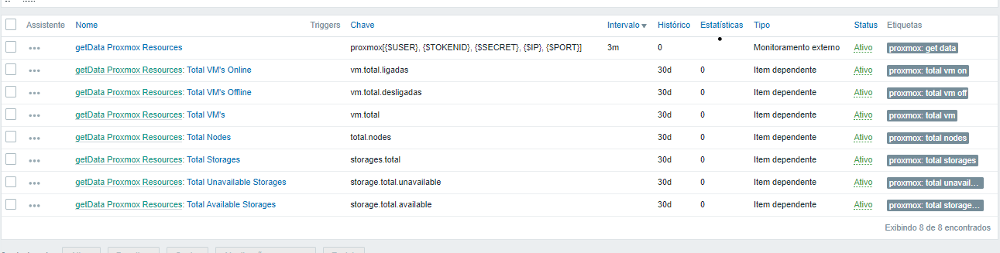

# Proxmox + Zabbix + Grafana

> Monitoring of Proxmox with Zabbix via external script using curl and authentication via Api Token

## 🏗️ UNDER CONSTRUCTION 🏗️

[Saulo Costa - Telegram](https://t.me/saulos2costa)

## Grafana

[Dashboard](grafana-dashboard.json)


## Support links

[Proxmox VE API](https://pve.proxmox.com/wiki/Proxmox_VE_API#API_URL)

[How to ignore invalid and self signed ssl connection errors with curl](https://www.cyberciti.biz/faq/how-to-curl-ignore-ssl-certificate-warnings-command-option/)

[remontti/Zabbix-Templates](https://github.com/remontti/Zabbix-Templates/blob/main/Huawei/BGP/README.md)

[Proxmox api-viewer](https://pve.proxmox.com/pve-docs/api-viewer/)

[Regex101.com](https://regex101.com/)

## Dependencies and Script

```sh
# Installation of curl
apt install curl
# Access the directory...
cd /usr/lib/zabbix/externalscripts
# Create a script with the name "proxmox"
nano proxmox
```

> Copy and paste the following script

```sh
#! /usr/bin/bash
curl -H "Authorization: PVEAPIToken=$1!$2=$3" https://$4:$5/api2/json/cluster/resources/ -k --silent
```

> Save and exit file

```sh
chown zabbix. /usr/lib/zabbix/externalscripts/proxmox
chmod +x proxmox
```

> Example to test the script

```sh
# Ex:
./proxmox usuário token_id secret ip_do_proxmox porta

# Ficará assim...
./proxmox root@pam dnriMrAAMBfacHdU ef43035e-1bd7-4e59-9469-68a290084a7d 172.33.255.2 8006
```

> If everything works out, it is expected that it will be returning a json with the data of the virtual machines and PVEs

## Telegram


## Zabbix

[Template](PROXMOX%20-%20SHEL%20SCRIPT%20-%20CURL%20-%20ZBX%205%204.yaml)



